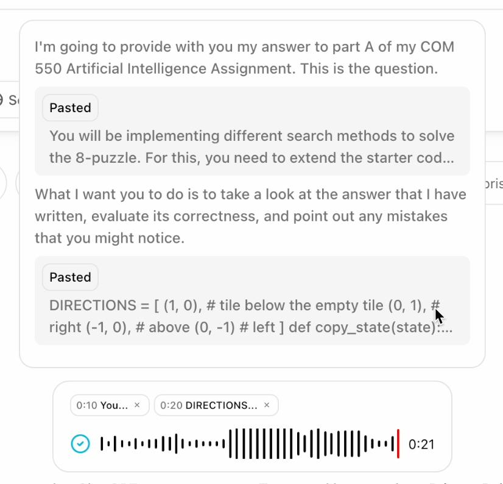

# Whisp

Whisp is a Chrome extension that brings voice dictation anywhere in the browser.

## Samples

Voice -> sending new prompt


## Motivation

Q: Why not just use Apple's Dictation?

OpenAI's Whisper model is till far superior.

It can accurately recognise my voice when I'm (1) whispering at the library
or (2) in a crowded environment like a loud coffee shop.

Q: Why not use SuperWhisper or Whispering?

SuperWhisper is paid, and it doesn't justify the cost for my use case.
I'm primarily interested in the transcription part and the API cost is almost nothing.

I tried Whispering but I couldn't get it to run in the browser.

As always, I think there's room for improvements to the UX in ways that are specific to my own use case.

## UX

I decided to develop this extension with the following requirements in mind:

### Requirement 1: It should feel native to the browser that I'm using (Arc)

The UI should be unobtrusive but feel responsive and natural.

When activating the extension, it should start recording immediately.

For the waveform and recorder UI,
I took a lot of inspiration from Xiaomi's Voice Recorder app and Instagram's voice message feature.

For the look of the floating window, I took inspiration from Claude,
ChatGPT, and Perplexity's Desktop apps.
The advantage of using the browser is that you can animate the appearance of
the floating window, which is something that the Desktop apps don't do.

### Requirement 2: It must feel seamless for the main use case - building prompts

When talking to ChatGPT or Claude, I have a tendency to write my prompts in this format:

```txt
< Some context explaining what I'm doing >

< Pasted code / homework assignment / essay question etc >

< Explanation of my approach to the problem >

< Pasted answer to the question >

< Instructing ChatGPT / Claude to do X task >
```

Essentially, I'm **pasting** some text into the chat from some other source
and **verbally** describing what I want the AI to do with it.

It's much faster to verbally describe the context than to type it out
(this is coming from someone who types 130+ WPM).

As I'm pasting the text, it should appropriately *interleave* the voice
and pasted text segments.


